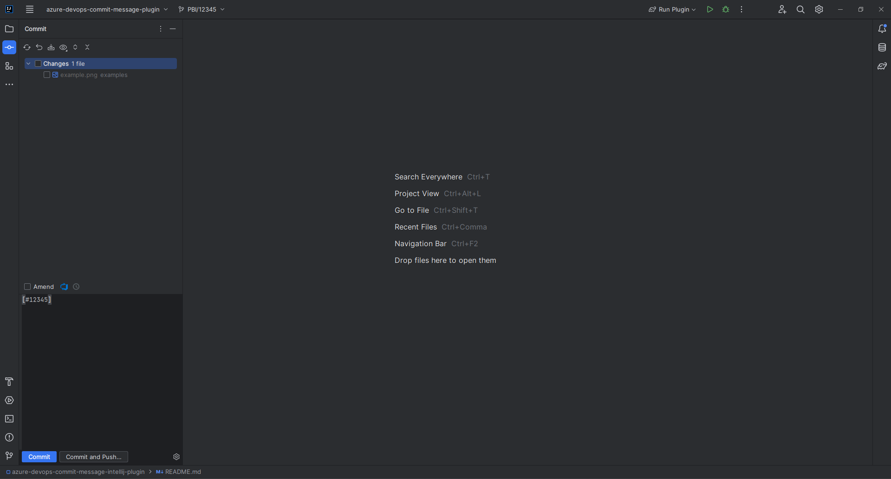

# azure-devops-commit-message-plugin

Azure DevOps commit message plugin helps you by automatically appending Azure DevOps PBI/BUG id to your commit messages.

<!-- Plugin description -->
A simple plugin that automatically populates the Git Commit message with the Branch PBI/BUG id
<!-- Plugin description end -->

### Installation

- Using IDE built-in plugin system:
  
  <kbd>Preferences</kbd> > <kbd>Plugins</kbd> > <kbd>Marketplace</kbd> > <kbd>Search for "Azure DevOps commit message"</kbd> >
  <kbd>Install Plugin</kbd>
  
- Manually:

  Download the [latest release](https://github.com/elicul/azure-devops-commit-message-intellij-plugin) and install it manually using
  <kbd>Preferences</kbd> > <kbd>Plugins</kbd> > <kbd>⚙️</kbd> > <kbd>Install plugin from disk...</kbd>

---

### How to use the plugin

Open Git commit tool or commit dialog and your commit message will already have the required PBI/BUG id populated. 

If you aren't familiar with the PBI/BUG branches creation please check more on this [link](https://learn.microsoft.com/en-us/azure/devops/boards/backlogs/connect-work-items-to-git-dev-ops?view=azure-devops).

Plugin based on the [IntelliJ Platform Plugin Template](https://github.com/JetBrains/intellij-platform-plugin-template).
